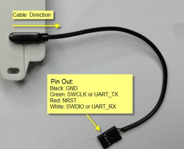
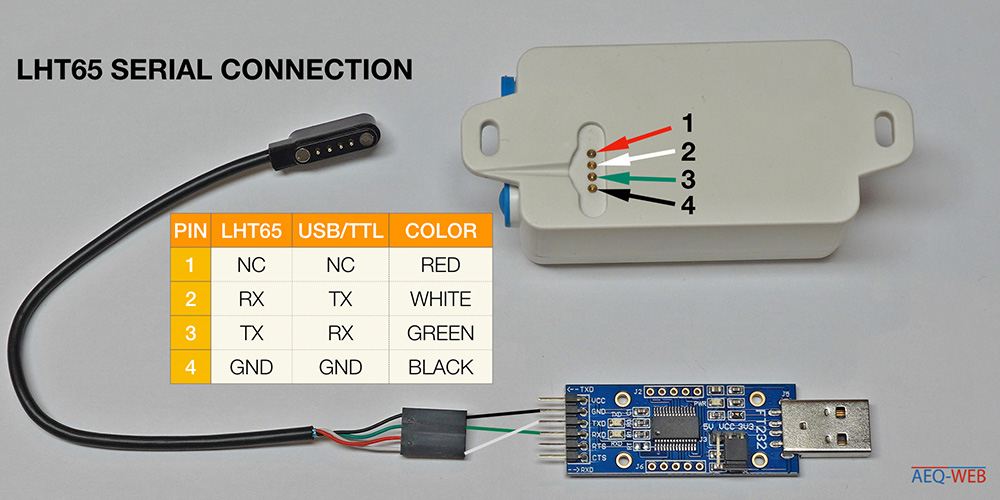
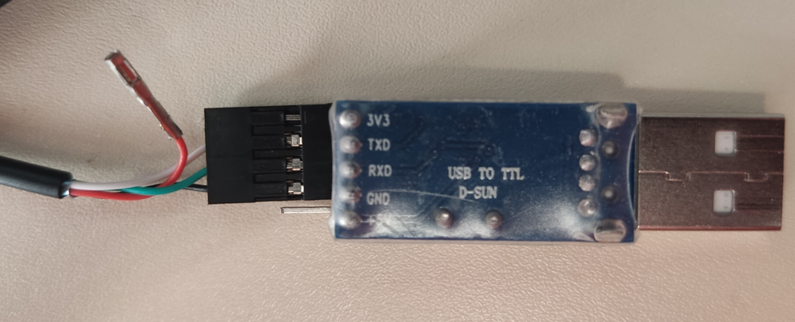
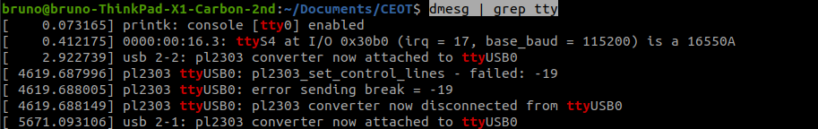
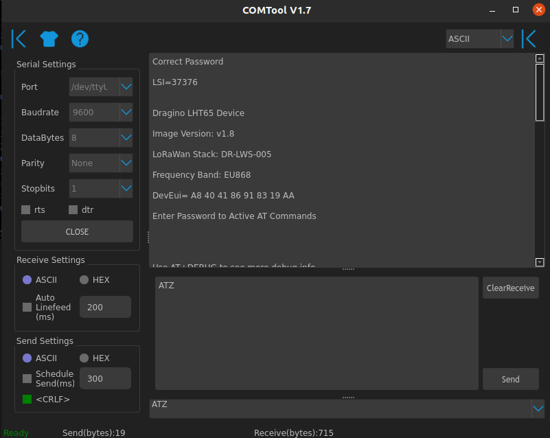

# DRAGINO LHT65 


The Dragino Temperature and & Humidity (LHT65) module is an environment
module that comes with a built-in SHT20 Temperature & Humidity sensor and
has a external sensor that allows external sensors to be connected, such as an
illumination sensor. This device works both as a data logger, recording up to 3200
environment measurements and also as a wireless sensor for network applications.
The battery of this device is a 2400mAh non chargeable battery that is ratted for
up to 10 years of utilization under optimal conditions (LoS communications and
sparse uplink rates).

Built-in temperature sensor information:
- Accuracy tolerance : Typ ± 0.3 ◦C
- Long term drift: < 0.02 ◦ C/yr
- Operating range: -40 ∼ 125 ◦C

Built-in humidity sensor information:
- Resolution: 0.04 % RH
- Accuracy tolerance: Typ ± 3 % PH
- Long term drift: < 0.02 ◦C/yr
- Operating range: 0 ∼ 96 % PH

External illumination sensor information:
- Resolution: 1 lx
- Range: 0-65535 lx
- Operating range: -40 ◦C ∼ 85 ◦C
With this device setup, the power consumption of the device is 4uA in idle
mode and 130mA when transmitting at maximum power

### Set Up

To config the lht65 it is necessary a TTL to USB converter which much be set up according to images following:









After this its necessary to find to which USB port the device is connected which can be done using the following commnad:
```bash
$ dmesg | grep tty 
```


TTL/USB converter name is pl2303, therefore the device is connected to COM ttyUSB0 (last line).


To be sure, before connecting to the device, you must have permission to access the port. 


```bash
# sudo chmod 666 /dev/<COMNAME>
$ sudo chmod 666 /dev/ttyUSB0
```


Connecting to the device can be done using putty, cu(https://www.cyberciti.biz/faq/find-out-linux-serial-ports-with-setserial/) or comtools (https://github.com/Neutree/COMTool).

After that, the LHT65 can be accessed by any of the previous serial tools. The example bellows uses ComTool




To change the device values, first insert the password and a **paragraph** (mandatory).

Examples of commands:


|Function| Command   |
|---|---|
|Deactivate ADR| AT+ADR=0|
|Change DR| AT+DR="number between 0 and 7"|
|Change Transmissing time| AT+TDC="number in miliseconds"|
|Get TXP from device|AT+TXP=?|
|Change the EXT device|AT+EXT=5|


### Decoder Code

The decoder code for Chirpstack.

```javascript
function Decode(fPort, bytes){
var data = {  
      //External sensor
      Ext_sensor:
      {
        "0":"No external sensor",
        "1":"Temperature Sensor",
        "4":"Interrupt Sensor send",
        "5":"Illumination Sensor",
        "6":"ADC Sensor",
        "7":"Interrupt Sensor count",
      }[bytes[6]&0x7F],
      
      //Battery,units:V
      BatV:((bytes[0]<<8 | bytes[1]) & 0x3FFF)/1000,
      
      //SHT20,temperature,units:
      // TempC_SHT:((bytes[2]<<24>>16 | bytes[3])/100).toFixed(2),
      // DARIO - Original (above) changed to return number instead of str
      TempC_SHT:((bytes[2]<<24>>16 | bytes[3])/100),

      //SHT20,Humidity,units:%
      //Hum_SHT:((bytes[4]<<8 | bytes[5])/10).toFixed(1),
      // DARIO - original (above) changed to return number instead of str
      Hum_SHT:((bytes[4]<<8 | bytes[5])/10),
      
      //DS18B20,temperature,units:
      TempC_DS:
      {
        "1":((bytes[7]<<24>>16 | bytes[8])/100).toFixed(2),
      }[bytes[6]&0xFF],      
      
      //Exti pin level,PA4
      Exti_pin_level:
      {
        "4":bytes[7] ? "High":"Low",
      }[bytes[6]&0x7F],
      
      //Exit pin status,PA4
      Exti_status:
      {
        "4":bytes[8] ? "True":"False",
      }[bytes[6]&0x7F],    
      
      //BH1750,illumination,units:lux
      ILL_lux:
      {
        "5":bytes[7]<<8 | bytes[8],
      }[bytes[6]&0x7F],  

      //ADC,PA4,units:V
      ADC_V:
      {
        "6":(bytes[7]<<8 | bytes[8])/1000,
      }[bytes[6]&0x7F],  
      
      //Exti count,PA4,units:times
      Exit_count:
      {
        "7":bytes[7]<<8 | bytes[8],
      }[bytes[6]&0x7F],  
      
      //Applicable to working mode 4567,and working mode 467 requires short circuit PA9 and PA10
      No_connect:
      {
        "1":"Sensor no connection",
      }[(bytes[6]&0x80)>>7],  
  };
  return data;
}
```


You can calculate the estimated batery time using this 
[spreadsheet](../assets/files/DRAGINO_Battery_Life_Prediction_Table_v1.2.xlsx)


More information can be found [here](https://www.dragino.com/downloads/downloads/LHT65/UserManual/LHT65_Temperature_Humidity_Sensor_UserManual_v1.8.5.pdf).


